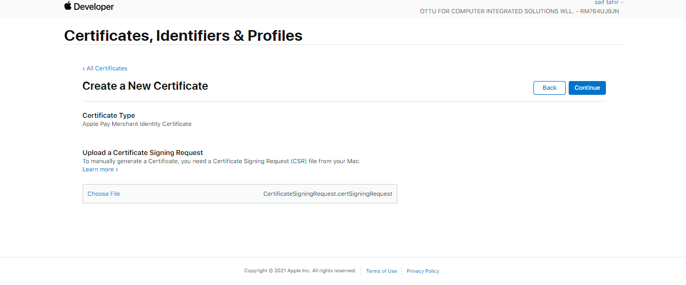

# Apple Pay

## [Introduction](./#introduction)

Generally, payment services refer to two main services: mobile payment and digital wallets.

## [Ottu payment services](./#ottu-payment-services)

Payment services are like different channels on top of bank integration that speed up charging customers.

## [Apple Pay](./#apple-pay)

Ottu supports Apple Pay in Kuwait, KSA and Bahrain.

## [Apple Pay configuration](./#apple-pay-configuration)

### [Apple Pay setup](./#apple-pay-setup)

### [Creating merchant ID](./#creating-merchant-id)

Merchant needs to have a developer account in Apple.

#### :digit\_one: [**Login to the account**](./#login-to-the-account)

#### :digit\_two:[**Go to “Certificates, IDs & Profiles” section**](./#go-to-certificates-ids-and-profiles-section)

#### :digit\_three:[**Go to “Identifiers”** ](./#go-to-identifiers)

From “App IDs” dropdown list .png>)choose “Merchant IDs”, then click on .png>) &#x20;

<figure><figcaption></figcaption></figure>

#### :digit\_four:[Choose the Merchant ID type ](./#choose-the-merchant-id-type)

Select “Merchant IDs” from the list of identifier types and click “Continue”.

#### :digit\_five:[**Enter the Merchant Information**](./#enter-the-merchant-information)

Provide the necessary details of the merchant, such as the display name and description. When entering the identifier field, it is recommended to include Ottu installation URL in reverse order. For instance, if your domain is “demo.ottu.net,” enter “net.ottu.demo” in the identifier field. Merchant will automatically show up.

<figure><figcaption></figcaption></figure>

#### :digit\_six:[**Click on register**](./#click-on-register)&#x20;

Review the provided details from the previous step before clicking on the “Register” button.

<figure><figcaption></figcaption></figure>

### [Adding and verifying a domain](./#adding-and-verifying-a-domain)

#### :digit\_seven:[Select the targeted identifier that was previously created](./#select-the-targeted-identifier-that-was-previously-created)

For demonstration purposes, let's consider the “Ottu Apple pay” ID from the “Identifiers” section.

<figure><figcaption></figcaption></figure>

#### :digit\_eight:[**Add merchant domain**](./#add-merchant-domain)

Click on “Add Domain” from “Merchant Domains” section.

<figure><figcaption></figcaption></figure>

#### &#x20; :digit\_nine:[**Enter the domain you want to register**](./#enter-the-domain-you-want-to-register)

Provide the domain URL, then save.

<figure><figcaption></figcaption></figure>

#### :digit\_one::digit\_zero:[**Download the “.text” file and provide it to Ottu**](./#download-the-.text-file-and-provide-it-to-ottu)

To verify the domain, download the “.text” file and ensure that you have it ready for uploading in the subsequent steps.

<figure><figcaption></figcaption></figure>

#### :digit\_one::digit\_one:[**Ottu will update and configure the file in the installation backend**](./#ottu-will-update-and-configure-the-file-in-the-installation-backend)

The Ottu side should include the new Apple Pay service that is specifically configured for the “Merchant ID” and “Merchant Domain”.

#### [How to Add New Apple Pay Service (Ottu side)](./#how-to-add-new-apple-pay-service-ottu-side)

After logging into Ottu dashboard, you click on the three dots located at the right corner of the page, which will lead you to the “Administration panel”. From the left pane in the “Administration panel” choose “Payment  Service”.

<figure><figcaption></figcaption></figure>

Click on “:heavy\_plus\_sign: Add payment service”.

\

<figure><figcaption></figcaption></figure>

Fill the required fields and click “Save”

<figure><figcaption></figcaption></figure>

<table><thead><tr><th>Field</th><th>Description</th><th data-hidden></th></tr></thead><tbody><tr><td>Name</td><td>The name to be displayed in the dropdown or any other location where the settings are shown</td><td></td></tr><tr><td>Code</td><td>Code to identify the service in the API/URLs/etc</td><td></td></tr><tr><td>Apple Merchant Identifier</td><td>Unique identifier assigned to a merchant by Apple when they sign up for Apple Pay</td><td></td></tr><tr><td>Display Name</td><td>The name that will appear on the payment sheet for Apple transactions</td><td></td></tr><tr><td>Domain</td><td>The domain configured for Apple pay. IE: ksa.ottu.dev</td><td></td></tr><tr><td>Domain Verification File</td><td>File that contains a unique code that is used to verify the ownership of a domain name</td><td></td></tr><tr><td>PG</td><td>Payment gateway</td><td></td></tr></tbody></table>

**New Apple Pay service for merchant.net.ottu.demo & demo.ottu.net has been added successfully.**

<figure><figcaption></figcaption></figure>

**To upload the “.text” file in** [step 10](./#download-the-.text-file-and-provide-it-to-ottu) Go to \
Ottu Dashboard > Administration Panel > Payment Service\
Choose the required Apple Pay service, which already added above. Named test.

<figure><figcaption></figcaption></figure>

Upload the “.text” file in [step 10](./#download-the-.text-file-and-provide-it-to-ottu) to “Domain Verification File”, then save.

<figure><figcaption></figcaption></figure>

#### :digit\_one::digit\_two:[Domain verification](./#domain-verification)

Once the [“.text” file](./#download-the-.text-file-and-provide-it-to-ottu) has been submitted to Ottu, on the Apple Pay side, navigate to the merchant domain section and click on the “verify” option to initiate the verification process for the domain. Ottu will then confirm the completion of this verification step.

<figure><figcaption></figcaption></figure>

#### &#x20;:digit\_one::digit\_three:[**The domain is verified**](./#the-domain-is-verified)

### [Creating Apple Pay certificates](./#creating-apple-pay-certificates)

#### :digit\_one::digit\_four:[**Go again to Certificates, Identifiers & profiles. Scroll down**](./#go-again-to-certificates-identifiers-and-profiles.-scroll-down)

<figure><figcaption></figcaption></figure>

#### &#x20;:digit\_one::digit\_five: [**Go to Apple Pay Merchant Identity Certificate and click on “create certificate”**](./#go-to-apple-pay-merchant-identity-certificate-and-click-on-create-certificate)

<figure><figcaption></figcaption></figure>

#### :digit\_one::digit\_six: [**Ottu will provide CSR certificate**](./#ottu-will-provide-csr-certificate)

After logging into Ottu dashboard, you click on the three dots located at the right corner of the page, which will lead you to the “Administration panel”. From the left pane in the “Administration panel” choose “Payment  Service”. \
Select the payment service which is designated for your “Merchant ID” & “Merchant Domain”. \
In case the payment service has not been added before, follow the [steps of adding new Apple Pay](./#how-to-add-new-apple-pay-service-ottu-side) payment service.&#x20;

<figure><figcaption></figcaption></figure>

Then click on “Download CSR file”.

<figure><figcaption></figcaption></figure>

#### :digit\_one::digit\_seven:[**Upload the CSR certificate**](./#upload-the-csr-certificate)

Upload the CSR file that has been provided by Ottu in [step 16](./#ottu-will-provide-csr-certificate).

.png>)

#### :digit\_one::digit\_eight:[**Click on Continue and then click download to get your .**CER **file**](./#click-on-continue-and-then-click-download-to-get-your-.cer-file)

#### :digit\_one::digit\_nine:[**Download the Certificate**](./#download-the-certificate) &#x20;

<figure><figcaption></figcaption></figure>

#### :digit\_two::digit\_zero:[**Provide the certificate (.cer) file to Ottu**](./#provide-the-certificate-.cer-file-to-ottu)

After logging into Ottu dashboard, you click on the three dots located at the right corner of the page which will lead you to the “Administration panel”. From the left pane in the “Administration panel” choose “Payment  Service”, then choose the same Apple Pay service  selected in [Step 16](./#ottu-will-provide-csr-certificate).

Then upload [.cer file](./#download-the-certificate) to “Apple Pay Identifier CER”, then click “Save”

<figure><figcaption></figcaption></figure>

After saving, “PEM Certificate” & “Key File” would be generated automatically.&#x20;

<figure><figcaption></figcaption></figure>

## [Creating apple payment processing certificate:](./#creating-apple-payment-processing-certificate)

Ottu empowers businesses with seamless payment process through Apple Pay across [MPGS](broken-reference), [Cybersource](broken-reference), and KNET gateways. Below, discover the effortless setup process for integrating different payment gateways with Apple Pay through Ottu. Experience simplified payments and enhanced user experience with our seamless integration process.


[setup-mpgs.md](setup-mpgs.md)



[setup-cybersource.md](setup-cybersource.md)

