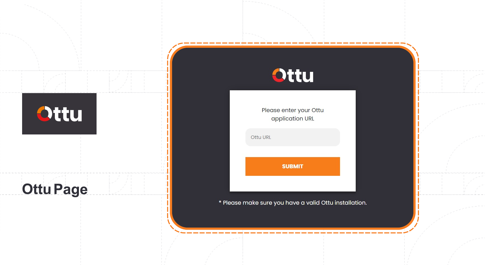

# Integration

## [Ottu integration](integration.md#ottu-integration)

Ottu is a fine-grained epayment solution, Ottu understands the high need for an epayment middleware integration to allow full communication with all well known e-commerce suites.

### [Payment gateways integration](integration.md#payment-gateways-integration)

Ottu offers direct-integration for merchants with their own bank account.

### [API integration](integration.md#api-integration)

Ottu understands the greater value direct integration could give to an e-commerce suite, well-organized API documentation should fit and support all types of direct integration.

### [Plug-in integration](integration.md#plug-in-integration)

Ottu merchants can easily connect with their e-commerce suites (e) the plug-ins and guidelines based on the merchant confirmed ecommerce platform. Plug-ins available for: Shopify, Wordpress-Woocommerce, PrestaShop, opencart, Magento, nopCommerce.

## [Shopify plugin](integration.md#shopify-plugin)

Shopify is a subscription-based software that allows anyone to set up an online store and sell their products. Shopify store owners can also sell in physical locations using Shopify POS, Shopify is a commerce platform that offers a way to quickly launch your dream business and start selling to your customers.If you are a Shopify merchant, Ottu platform solution will be the best choice for you. Start integrating your ecommerce platform with Ottu platform via Shopify plugin and begin utilizing the useful features of Ottu platform.

## [**Ottu payment app installation guide for Shopify merchants**](integration.md#ottu-payment-app-installation-guide-for-shopify-merchants)

#### [Step 1](integration.md#step-1)

Go to the Ottu App Listing Page-[ https://apps.shopify.com/debit-credit-cards](https://apps.shopify.com/debit-credit-cards) and Login to your Shopify account with your registered email ID and password:

.png>)

#### [Step 2](integration.md#step-2)

After logging in, select the stores that you have in your Shopify account.

.png>)

#### [Step 3](integration.md#step-3)

&#x20;After selecting the store where you want to install the payment app, click on “Add app”.

.png>)

#### [Step 4](integration.md#step-4)

After adding the app, you will be redirected to the below page. Click on “Install app”.

 (1).png>)

#### [Step 5](integration.md#step-5)

After clicking install app, you will be redirected to the Ottu Page as below:

#### [Step 6](integration.md#step-6)

Enter your Ottu installation URL that will be provided by the Ottu Onboarding team after signing the agreement. An example of the URL is [https://pay.yourdomain.com](https://pay.yourdomain.com).

.png>)

#### [Step 7](integration.md#step-7)

Select the payment methods that you want to display to your customers from the list and click on “Activate Ottu”.

 (2).png>)

#### [Step 8](integration.md#step-8)

Finally, Ottu App appears in your payment settings as below.

### [Ottu portal transactions interface for Shopify.](integration.md#ottu-portal-transactions-interface-for-shopify.)

From the Ottu portal under the Shopify Tab, go to the transaction option.\
From transaction page, merchant can get the following information for whole transactions:

* Total generated
* Total received
* Net balance

 (1).png>)

In the table at the bottom of the page, you can find details about each transaction process, as well as the status of each one. The state can be varied as follows:\
Paid state, failed state, attempted state and created state.

.png>)

## [Payment request](plugins/#payment-request)

## [Bulk payment request](plugins/#bulk-payment-request)

## [E-commerce](plugins/#e-commerce)
